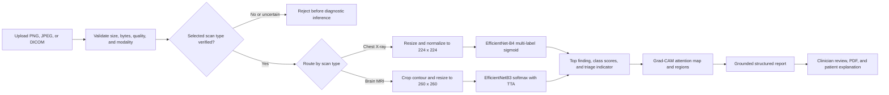
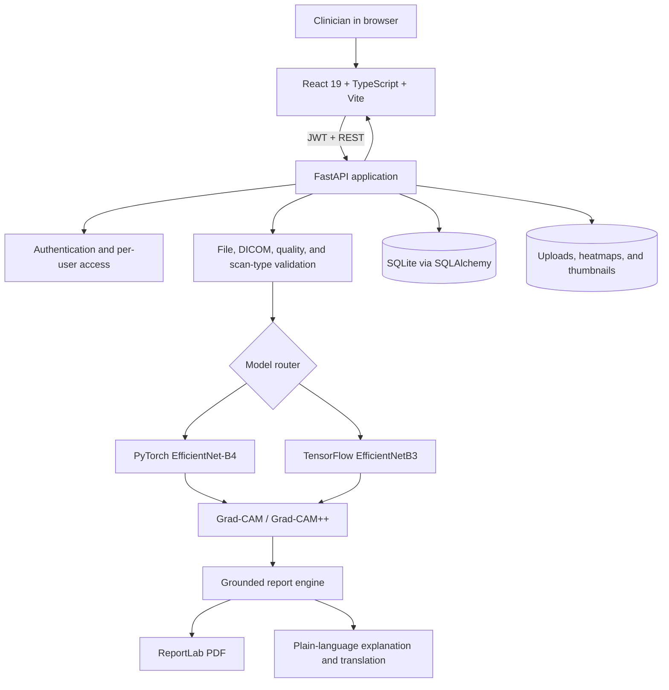

# MedoraAI Hackathon Concept Demonstration Video Guide

This is the recording and speaking plan for the national-level hackathon concept demonstration. It is based on the current repository and UI, not only on older planning documents.

## 1. Recommended Submission Format

Create a **6 minute 45 second hybrid video**:

- Brief slides for the problem, solution, algorithm, architecture, implementation, and team.
- A real screen-recorded product demonstration for the central part of the video.
- Clear voice narration throughout.
- Optional small webcam view only during the team introduction.
- 1920 × 1080 resolution, 30 frames per second, landscape orientation.
- English narration with burned-in English subtitles.

This format is stronger than an all-PPT video because the judges can see that the system is implemented, while the slides make the technical thinking easy to follow.

If the Unstop submission page specifies a shorter duration, use the three-minute cut described later in this guide. Check the current portal for the exact duration, file-size, format, and deadline before exporting.

### One-line project pitch

> MedoraAI is an explainable, multi-modal medical-imaging decision-support platform that validates an uploaded scan, routes it to a task-specific model, visualizes the model's attention, and converts the result into clinician and patient-facing communication.

### Naming decision before recording

The current product, repository, UI, and API use **MedoraAI**. An older abstract uses **VaidyaAI**.

Use one name everywhere:

1. Check the project name registered on Unstop.
2. If it says MedoraAI, use MedoraAI throughout the video and slides.
3. If it says VaidyaAI, either update the registration to MedoraAI or replace every spoken and visible MedoraAI reference in the submission material.
4. Never alternate between both names in the final video.

This guide uses **MedoraAI**.

## 2. How the Video Covers Every Required Point

| Hackathon requirement | Video section | Approximate time |
| --- | --- | ---: |
| Problem understanding | Problem slide and narration | 0:15–0:55 |
| Proposed solution approach | Solution slide | 0:55–1:35 |
| Algorithm flowchart | Algorithm slide | 1:35–2:15 |
| System architecture/design | Architecture slide | 2:15–2:55 |
| Actual concept demonstration | Live MedoraAI workflow | 2:55–5:25 |
| Technical workflow and implementation strategy | Implementation slide | 5:25–5:55 |
| Introduction of team members | Team slide and optional webcam | 5:55–6:25 |
| Impact, safety, and closing | Final slide | 6:25–6:45 |

## 3. Claims That Are Safe to Make

The current implementation supports:

- JWT-protected login and per-user scan access.
- Chest X-ray and brain MRI workflows.
- PNG, JPEG, and DICOM upload, with a 20 MB configured maximum.
- Magic-byte, image-quality, modality, and scan-type validation before inference.
- A fail-closed verification path for uncertain or mismatched inputs.
- A PyTorch EfficientNet-B4 chest model with 15 NIH ChestXray14-compatible output labels.
- A TensorFlow/Keras EfficientNetB3 brain model with four classes: Glioma, Meningioma, No Tumor, and Pituitary.
- Brain-model test-time augmentation.
- Grad-CAM/Grad-CAM++ heatmaps and heatmap-derived bounding-box data.
- A confidence-derived priority/severity label.
- A structured, editable clinician report with deterministic grounding rules.
- A patient-friendly explanation in English and configured translation support for ten Indian languages.
- PDF report generation, thumbnails, and study history.
- React, TypeScript, Vite, FastAPI, SQLAlchemy, SQLite, PyTorch, TensorFlow/Keras, OpenCV, Pillow, pydicom, and ReportLab.
- Docker Compose deployment.

### Claims to avoid unless the team has measured evidence

Do **not** say any of the following without a saved evaluation result:

- “The model is 90% accurate.”
- “The model is more accurate than a radiologist.”
- “Every diagnosis completes in under three seconds.”
- “The system is production-ready or clinically approved.”
- “The heatmap proves the location of a lesion.”
- “The severity badge is a clinically validated disease-grade.”
- “No medical data ever leaves the device.”

Use these accurate alternatives:

- “The repository includes evaluation tooling for per-label AUC, precision, recall, F1, and exact-match accuracy.”
- “Processing time is measured per study and displayed in the result.”
- “This is an experimental decision-support system and its output requires clinician review.”
- “Grad-CAM indicates which image regions most influenced the model; it is not proof of lesion localization.”
- “The displayed severity is a rule-based triage indicator derived from output label and confidence, not a validated clinical staging score.”
- “Classification runs locally. If an image-aware external report provider is configured, the uploaded image may be sent to that provider; the deterministic local template can be used instead.”

## 4. Prepare the Demo Before Recording

### 4.1 Assign the speakers

A four-member speaking split is recommended:

| Speaker | Suggested section | What to prepare |
| --- | --- | --- |
| Prachi Doshi | Hook, problem, solution | Why the problem matters and the product vision |
| Yashrajsinh Jadeja | Algorithm and ML flow | Model routing, preprocessing, classification, Grad-CAM |
| Madhav Joshi | Architecture and live product demo | Frontend-to-backend flow and screen actions |
| Dinesh Yadav | Implementation, team, and closing | Stack, safety, limitations, future direction |

These are suggested speaking assignments, not claims about who built each component. On the team slide, replace every `[ACTUAL CONTRIBUTION]` placeholder with the member's real contribution.

If one person has the clearest microphone, that person can narrate the entire demo. Each member should still appear or speak briefly during the team section if the rules expect a team introduction.

### 4.2 Prepare safe demo images

Prepare three legally usable, de-identified files:

1. One chest X-ray that produces a stable, visually useful result.
2. One brain MRI that produces a stable four-class result.
3. One non-medical image or deliberately mismatched scan for an optional validation demonstration.

Rules:

- Do not use an image containing a patient's name, hospital number, date of birth, accession number, or other identifying data.
- Do not use a real patient's scan without the required permission.
- Use open or team-owned demo data whose license permits demonstration.
- Rename files cleanly, for example `demo_chest_xray.png` and `demo_brain_mri.png`.
- Keep demo images outside the Git repository, for example in `C:\tmp\medoraai_demo`.
- Do not show a cluttered Downloads folder during the file-picker scene.

The repository's `demo` directory currently does not contain sample scans, so this preparation is mandatory.

### 4.3 Confirm the model paths

The current chest model exists at:

```text
models/chest_xray_efficientnet_b4.pt
```

The current configured EfficientNetB3 brain artifact exists at:

```text
models/best_brain_model.keras
```

Before recording, make sure the private `.env` continues to point to these real locations:

```env
CHEST_MODEL_PATH=./models/chest_xray_efficientnet_b4.pt
BRAIN_MODEL_PATH=./models/best_brain_model.keras
```

Never show `.env` in the video. It can contain API keys and other secrets.

### 4.4 Start the application

Open two PowerShell terminals.

Backend terminal:

```powershell
cd C:\Users\gamin\Desktop\INTELLFIY\WINNING_IT\MedoraAI\backend
python -m uvicorn main:app --reload --host 127.0.0.1 --port 8000
```

If the team creates the optional `backend\.venv` described in the README, activate it before the `uvicorn` command:

```powershell
.\.venv\Scripts\Activate.ps1
```

Frontend terminal:

```powershell
cd C:\Users\gamin\Desktop\INTELLFIY\WINNING_IT\MedoraAI\frontend
npm run dev -- --host 127.0.0.1 --port 5173
```

Open:

```text
http://127.0.0.1:5173
```

Development login:

```text
Username: demo
Password: demo123
```

Before recording, verify the backend from PowerShell:

```powershell
Invoke-RestMethod http://127.0.0.1:8000/health
```

Expected high-level result:

```text
status     : ok
chest_xray: loaded
brain_mri : loaded
```

Also inspect the backend startup messages. Confirm that they include:

```text
Loaded fine-tuned weights from ...
Loaded brain tumor model from ...
```

Do not proceed if the log says:

```text
Could not load weights
BrainTumorClassifier initialized WITHOUT a trained model
```

The health endpoint only confirms that service objects were initialized; the startup messages provide the stronger check that the intended trained artifacts loaded.

### 4.5 Verify the build and regression checks

Run:

```powershell
cd C:\Users\gamin\Desktop\INTELLFIY\WINNING_IT\MedoraAI\backend
python -m unittest discover -s tests -v
```

Then:

```powershell
cd C:\Users\gamin\Desktop\INTELLFIY\WINNING_IT\MedoraAI\frontend
npm run build
```

At the time this guide was prepared:

- All 25 backend regression tests passed.
- The frontend production build completed successfully.
- The installed Node.js version was 20.17.0, while the current Vite package warns that it requires Node.js 20.19+ or 22.12+.

Upgrade Node.js before the final recording so the demo environment matches the frontend toolchain requirement.

### 4.6 Rehearse every network-dependent feature

Test the exact same files and buttons you will show:

- Upload and scan-type verification.
- Chest or brain inference.
- Heatmap display.
- Report generation.
- PDF download.
- Patient explanation.
- Selected translation language, if used.

The report engine has a deterministic template fallback, so a report can still be produced without an LLM. Translation also has a safe fallback, but the UI may return English with a translation-unavailable notice when the translation service is not configured.

Therefore:

- Demonstrate Hindi, Gujarati, or another translated language only if it succeeds twice during rehearsal.
- Otherwise demonstrate the English patient explanation and say that the architecture supports configured translation.
- Do not depend on a fresh external API call for the only successful take.

### 4.7 Prepare history for a smooth multi-modal demonstration

Before recording:

1. Analyze one chest X-ray.
2. Analyze one brain MRI.
3. Confirm both studies appear in the history sidebar.
4. Open each result and verify that the images and reports still load.
5. Leave the upload dashboard open for the start of the product demo.

During the recording, perform one fresh chest analysis and use the history sidebar to open the already-analyzed brain MRI. This proves multi-modal support without waiting for two complete inference runs.

### 4.8 Browser preparation

- Use Chrome or Edge in a clean browser profile.
- Close email, chat, cloud drives, and unrelated tabs.
- Disable pop-up notifications and Focus Assist interruptions.
- Hide the bookmarks bar.
- Use 100% browser zoom first; use 90% only if the results page does not fit.
- Keep the window at a 16:9 size.
- Preload slides in one tab and MedoraAI in another.
- Do not show API keys, terminal environment output, personal directories, or private Git content.
- Close browser developer tools.
- Move the mouse slowly and deliberately.

## 5. Slide Content

Use large text, one diagram per technical slide, and no paragraphs. The narration carries the detail.

### Slide 1 — Title and hook

**Title:** MedoraAI  
**Subtitle:** Explainable Multi-Modal Medical Imaging Decision Support  
**Footer:** Team CodeRoaches · Marwadi University

Optional hook on the slide:

> From a raw scan to an explainable, review-ready draft.

### Slide 2 — Problem understanding

Use four short blocks:

1. **Growing review workload** — Routine scan review and report drafting consume specialist time.
2. **Black-box output** — A label without evidence is difficult to trust.
3. **Unsafe inputs** — A wrong modality or non-medical image can produce misleading confidence.
4. **Communication gap** — Clinical terminology is difficult for patients to understand.

Bottom line:

> The problem is not only classification; it is building a safe and explainable scan-to-communication workflow.

### Slide 3 — Proposed solution

Show this chain:

```text
Validate → Route → Classify → Explain → Report → Communicate
```

Add six short labels:

- Chest X-ray + brain MRI
- Pre-inference scan verification
- Task-specific EfficientNet models
- Grad-CAM visual explanation
- Editable clinician report + PDF
- Patient-friendly multilingual explanation

### Slide 4 — Algorithm flowchart

Render the following Mermaid diagram and place the exported image on the slide:



The key story is the rejection branch. MedoraAI attempts to stop a mismatched or uncertain input **before** diagnostic inference.

### Slide 5 — System architecture

Render this architecture diagram:



Small footer:

```text
Docker Compose packages the frontend, backend, models, and persistent runtime data.
```

### Slide 6 — Implementation strategy

Use three columns:

**Safety first**

- Magic-byte and anatomy validation
- Fail closed on uncertainty
- Grounded report rules
- Mandatory clinician review

**Modular implementation**

- Separate models per modality
- REST contracts between UI and AI
- Deterministic fallbacks
- Regression-tested report and PDF flow

**Deployment and next steps**

- Docker Compose
- External validation and calibration
- PACS/EMR integration
- Regulatory and privacy hardening

### Slide 7 — Team

Use headshots only if all members use similar lighting and framing.

```text
Team CodeRoaches — Marwadi University

Prachi Doshi       — [ACTUAL CONTRIBUTION]
Yashrajsinh Jadeja — [ACTUAL CONTRIBUTION]
Madhav Joshi       — [ACTUAL CONTRIBUTION]
Dinesh Yadav       — [ACTUAL CONTRIBUTION]
```

Do not invent roles. Use the actual work completed by each member, such as ML training, backend, frontend, testing, research, product design, or deployment.

### Slide 8 — Closing

**Large text:**

> MedoraAI makes medical AI more useful by making it safer, explainable, and reviewable.

**Small text:**

> Experimental decision support · Not a certified medical device · Clinician review required

## 6. Exact 6:45 Recording Timeline

| Time | Screen | Action |
| --- | --- | --- |
| 0:00–0:15 | Slide 1 | Title, hook, and team name |
| 0:15–0:55 | Slide 2 | Explain the real workflow problem |
| 0:55–1:35 | Slide 3 | Present the six-stage solution |
| 1:35–2:15 | Slide 4 | Animate or highlight the algorithm from left to right |
| 2:15–2:55 | Slide 5 | Explain the browser, API, ML, reporting, and storage layers |
| 2:55–3:08 | MedoraAI login | Sign in with the prepared demo account |
| 3:08–3:32 | Upload page | Select Chest X-Ray and upload the rehearsed image |
| 3:32–3:43 | Processing overlay | Let the progress labels appear |
| 3:43–4:18 | Results page | Show original, heatmap, compare, class scores, and processing time |
| 4:18–4:52 | Clinician report | Scroll through sections, make one small edit, show PDF action |
| 4:52–5:10 | Patient explanation | Generate the rehearsed language or English summary |
| 5:10–5:25 | History sidebar | Open the pre-analyzed brain MRI result |
| 5:25–5:55 | Slide 6 | Explain implementation strategy and honest next steps |
| 5:55–6:25 | Slide 7 | Introduce all four team members |
| 6:25–6:45 | Slide 8 | State impact, safety boundary, and closing line |

## 7. Full Narration Script

The script is deliberately written in short spoken sentences. Speak naturally at approximately 130–140 words per minute. Do not rush to match a timestamp; remove a sentence during editing if needed.

### 0:00–0:15 — Hook and title

**Screen:** Slide 1.

**Speaker: Prachi**

> A medical-AI prediction is not useful if the system cannot verify the input, explain the evidence, or support a clinician's workflow. We are Team CodeRoaches from Marwadi University, and this is MedoraAI—our explainable, multi-modal medical-imaging decision-support platform.

### 0:15–0:55 — Problem understanding

**Screen:** Slide 2. Highlight one block at a time.

**Speaker: Prachi**

> We understood the problem as more than image classification. A radiologist starts with a raw scan, checks whether the study is usable, examines possible findings, records an interpretation, and then communicates it safely. Many AI prototypes only return a label and confidence score. They may accept the wrong anatomy, provide no visual reasoning, and leave reporting and patient communication as separate manual tasks. Our goal is therefore to shorten the routine scan-to-report workflow while keeping the clinician in control. The system must reject unsuitable inputs, show why a model responded, create an editable draft, and clearly state its limitations.

### 0:55–1:35 — Proposed solution

**Screen:** Slide 3. Reveal each word in the chain.

**Speaker: Prachi**

> MedoraAI implements a six-stage approach: validate, route, classify, explain, report, and communicate. It supports chest X-rays and brain MRI images through separate task-specific models. Before diagnostic inference, the upload passes file, image-quality, modality, and scan-type checks. The verified image is routed to the correct model. The result includes class scores and a triage indicator, while Grad-CAM shows the regions that most influenced the output. A grounded report engine then prepares a structured clinician draft. The clinician can edit it, export a PDF, or generate a plain-language patient explanation. This is decision support, not autonomous diagnosis.

### 1:35–2:15 — Algorithm flow

**Screen:** Slide 4. Follow the arrows with a subtle pointer or animation.

**Speaker: Yashrajsinh**

> The algorithm begins with PNG, JPEG, or DICOM input. We validate the file signature, size, image properties, and available DICOM modality. An independent scan-type gate verifies that the image matches the selected chest or brain workflow. A mismatch or uncertain input is rejected before classification. A chest image is resized and normalized for EfficientNet-B4, which produces multi-label sigmoid scores across fifteen labels. A brain MRI is contour-cropped, resized to 260 by 260, and evaluated by EfficientNetB3 using softmax and test-time augmentation. The selected result drives a Grad-CAM attention map. Finally, deterministic grounding rules constrain the report to what can be supported by the supplied single image.

### 2:15–2:55 — System architecture

**Screen:** Slide 5. Highlight layers from top to bottom.

**Speaker: Madhav**

> The architecture separates presentation, orchestration, inference, and persistence. The React and TypeScript frontend communicates with FastAPI through JWT-protected REST endpoints. FastAPI handles authentication, upload validation, DICOM parsing, and model routing. PyTorch serves the chest model, while TensorFlow and Keras serve the brain model. Their outputs feed the Grad-CAM and report services. SQLAlchemy with SQLite stores users, studies, results, and reports, while generated scans, thumbnails, and heatmaps are stored as runtime files. ReportLab creates professional PDFs, and the patient service produces simplified explanations with optional translation. Docker Compose packages the deployable stack.

### 2:55–3:08 — Login

**Screen:** Switch to the clean MedoraAI browser tab. Sign in.

**Speaker: Madhav**

> Let us demonstrate the implemented workflow. The clinician first enters the protected workspace. The session token is used for authenticated API access, and each stored study is associated with its user.

### 3:08–3:32 — Select and upload

**Screen actions:**

1. Select **Chest X-Ray**.
2. Pause briefly so the model name is visible.
3. Drag or select `demo_chest_xray.png`.
4. Start analysis.

**Speaker: Madhav**

> On the diagnostic console, we choose the study type. The interface shows that chest analysis uses EfficientNet-B4. We now upload a de-identified chest radiograph. Before it reaches the diagnostic model, MedoraAI validates the actual file bytes, checks image usability, and verifies that the anatomy matches the selected workflow. This reduces the risk of producing a confident-looking result for an unrelated image.

### 3:32–3:43 — Processing

**Screen:** Leave the processing overlay visible. Do not speed this part up beyond two-times speed.

**Speaker: Madhav**

> The backend now performs classification, creates the Grad-CAM visualization, maps the output to a review priority, and prepares the structured report.

### 3:43–4:18 — Results and explainability

**Screen actions:**

1. Show the primary finding and confidence.
2. Briefly point to the class comparison.
3. Toggle **Original**.
4. Toggle **Grad-CAM heatmap**.
5. Toggle **Compare**.
6. Point to processing time.

**Speaker: Madhav**

> The result page brings the evidence and the model output together. Here we can see the strongest model finding, its match score, the other class scores, and the measured processing time for this study. The viewer lets the clinician compare the source image with the Grad-CAM overlay. The heatmap represents model attention; it does not prove a lesion location. Its purpose is to help a reviewer judge whether the model focused on a plausible region instead of blindly accepting a label.

Do not name the displayed disease or read its percentage from this script. State the real on-screen result during the recording:

> For this rehearsed image, the strongest output is **[READ DISPLAYED LABEL]** at **[READ DISPLAYED PERCENTAGE]**.

### 4:18–4:52 — Editable clinician report and PDF

**Screen actions:**

1. Scroll at a controlled speed.
2. Pause on Technique, Findings, Impression, Recommendations, and the disclaimer.
3. Add a harmless phrase such as `Correlate with the complete source examination.` to Recommendations.
4. Show the “Edited draft” state.
5. Click **Download clinical PDF** only if it was tested immediately before recording.
6. Optionally insert a three-second shot of the generated PDF.

**Speaker: Madhav**

> Below the image review is a structured preliminary report. It separates technique, study limitations, findings, impression, differential considerations, recommendations, and communication. Grounding rules prevent the report from inventing unavailable MRI sequences, contrast status, comparison studies, or unsupported measurements. The clinician remains the decision-maker and can revise the text before export. Here I make a small review edit, and that edit is included in the generated PDF along with the medical-AI disclaimer.

### 4:52–5:10 — Patient explanation

**Screen actions:**

1. Open **Patient explanation**.
2. Select the language proven reliable during rehearsal, or leave English selected.
3. Click **Create explanation**.
4. Pause on the four structured headings.

**Speaker: Madhav**

> The same reviewed information can be converted into calmer, plain language for the patient. The service separates clinical generation from translation and deliberately removes model names, confidence scores, and implementation terms. This explanation must still be shared only after review by the treating clinician.

If the selected translation is visible and correct, add:

> Here the explanation is presented in **[LANGUAGE]**, improving accessibility without changing the underlying clinical meaning.

### 5:10–5:25 — History and second modality

**Screen actions:**

1. Point to the saved chest study in history.
2. Open the pre-analyzed brain MRI result.
3. Pause on its four-class score panel and heatmap.

**Speaker: Madhav**

> Studies and their thumbnails remain available in the authenticated history. From here, I can open our prepared brain MRI case. The same interface now uses the separate EfficientNetB3 four-class model and its own Grad-CAM pipeline, showing that the architecture is multi-modal rather than one classifier with renamed labels.

### 5:25–5:55 — Technical workflow and implementation strategy

**Screen:** Slide 6.

**Speaker: Dinesh**

> Our implementation strategy prioritizes safe boundaries and modular components. Validation happens before inference. Each modality has an independent classifier and explainability service. The API contract keeps the frontend separate from the ML stack. Report generation has deterministic fallbacks and a final grounding pass, so a provider failure does not have to break the workflow. Regression tests cover scan rejection, report grounding, patient-language fallback, and multi-page PDF generation. Our next steps are full held-out model evaluation, threshold calibration, stronger out-of-distribution detection, private clinical deployment, and PACS or EMR integration.

### 5:55–6:25 — Team introduction

**Screen:** Slide 7. Optional webcam clips can appear beside the relevant name.

**Speaker: each member for one sentence**

> I am Prachi Doshi, and I worked on **[ACTUAL CONTRIBUTION]**.

> I am Yashrajsinh Jadeja, and I worked on **[ACTUAL CONTRIBUTION]**.

> I am Madhav Joshi, and I worked on **[ACTUAL CONTRIBUTION]**.

> I am Dinesh Yadav, and I worked on **[ACTUAL CONTRIBUTION]**.

**Final team speaker:**

> Together, Team CodeRoaches combined medical-AI research, model integration, full-stack engineering, explainability, reporting, and safety-focused testing into one working workflow.

### 6:25–6:45 — Impact and close

**Screen:** Slide 8.

**Speaker: Dinesh or Prachi**

> MedoraAI does not attempt to replace clinical expertise. It makes an AI-assisted review more useful by connecting input safety, task-specific inference, visual explanation, report drafting, and patient communication. Our aim is a faster and more transparent workflow in which the clinician always has the final decision. Thank you.

Leave the final slide visible for two seconds after the last word.

## 8. Optional Validation Insert

If scan rejection works reliably during two rehearsals, add a 10–12 second insert after the algorithm slide:

**Screen action:** Choose Brain MRI and upload a clearly non-medical image or the chest demo image.

**Narration:**

> Here, the selected workflow and the uploaded content do not match. MedoraAI rejects the input before diagnostic inference instead of forcing the model to produce a misleading label.

Do not include this scene if the external verification service is unstable. A failed live demonstration weakens the safety story more than a clear architectural explanation.

## 9. Three-Minute Emergency Cut

If the portal permits only approximately three minutes, use this structure:

| Time | Content |
| --- | --- |
| 0:00–0:20 | Hook, team, and one-sentence problem |
| 0:20–0:45 | Proposed six-stage solution |
| 0:45–1:05 | Combined algorithm and architecture slide |
| 1:05–2:25 | Upload, heatmap, scores, report, patient summary, and brain history |
| 2:25–2:45 | Implementation stack and safety boundary |
| 2:45–3:00 | Team names and closing |

Cut detail; do not speed the narration unnaturally. Keep these product actions:

1. Select modality.
2. Upload a real test scan.
3. Show result and heatmap comparison.
4. Show editable report.
5. Show patient explanation.
6. Show the second modality in history.

## 10. Recording Setup

### 10.1 Recommended recording method

Use OBS Studio or another recorder that can capture:

- One application window or full display.
- A microphone.
- Optional webcam.
- 1080p output.

For the most reliable result, record in short scenes rather than one uninterrupted take:

1. Record slides and narration.
2. Record the product screen actions.
3. Record missing narration as voiceover.
4. Record team introductions.
5. Assemble and caption the scenes in an editor.

This still counts as a spoken screen demonstration, but it lets the team remove loading delays and failed takes.

### 10.2 OBS-style settings

Use:

```text
Base canvas:       1920 × 1080
Output resolution: 1920 × 1080
Frame rate:        30 FPS
Audio sample rate: 48 kHz
Recording format:  MKV during capture, then remux to MP4
```

MKV is safer while recording because an interrupted capture is less likely to corrupt the whole file. Export the final submission as MP4 unless Unstop states otherwise.

Capture choices:

- Prefer **Window Capture** for the browser so notifications and other apps cannot appear.
- Use **Display Capture** only if slide-to-browser switching cannot be captured cleanly.
- Capture slides separately if transitions look untidy.
- Keep webcam size below roughly 15% of the frame so it does not cover product controls.

### 10.3 Audio setup

- Record in a room with curtains, beds, or soft furnishings to reduce echo.
- Keep the microphone 15–20 cm from the speaker.
- Use wired earphones with a microphone if the laptop microphone sounds distant.
- Place the microphone slightly to the side to reduce breath noise.
- Aim for speech peaks around -12 dB to -6 dB without reaching 0 dB.
- Record a 20-second test and listen with headphones.
- Turn off fans when safe, silence phones, and close the door.
- Speak slightly slower than normal conversation.
- Smile while speaking; it improves vocal energy.

If available, apply gentle noise suppression, a light compressor, and a limiter. Avoid aggressive noise removal that makes speech metallic.

### 10.4 Screen presentation

- Use slow cursor movement.
- Pause for one second after each click.
- Do not circle the pointer continuously.
- Zoom into a result only in editing, not with erratic browser zoom.
- Use a subtle highlight box or arrow in editing for the current item.
- Keep on-screen text visible long enough to be read.
- Remove waiting periods longer than three seconds, but do not make inference appear instantaneous.
- Label any accelerated section `2× speed`.

## 11. Editing Plan

Use any editor the team knows well. The exact software matters less than clear audio and pacing.

Editing order:

1. Place the best narration or voiceover.
2. Align each screen action with the spoken sentence.
3. Remove mouse mistakes, login delays, and empty loading time.
4. Add section labels:
   - Problem
   - Solution
   - Algorithm
   - Architecture
   - Live Demonstration
   - Implementation
   - Team
5. Add English subtitles.
6. Add small labels for technologies only when first mentioned.
7. Add the clinical disclaimer on the result and final scenes.
8. Normalize voice volume across all speakers.
9. Use only simple cuts and short fades.
10. Watch the full export twice.

Avoid:

- Loud background music.
- Rapid cinematic transitions.
- AI-generated stock hospital footage that distracts from the working product.
- Long code scrolling.
- Reading every item visible on a slide.
- Showing terminal installation logs as the central proof.
- Hiding system limitations.

If music is used, choose properly licensed instrumental music and keep it approximately 20–25 dB below the narration.

## 12. What to Show and What Not to Show

### Show

- The polished login and dashboard.
- The modality choice and corresponding model label.
- One real upload and progress state.
- Original, heatmap, and compare modes.
- Primary result and class comparison.
- The measured processing time.
- Editable report sections.
- The required disclaimer.
- PDF action.
- Patient explanation.
- Saved history and second modality.

### Do not show

- `.env`.
- API keys.
- Personal email, chat, or notifications.
- Patient-identifying information.
- A random image that the model classifies without validation.
- A report claim that contradicts the visible model result.
- Private repository tokens or Git remotes containing credentials.
- Unverified accuracy slides.
- A brain result with zero confidence, because that indicates the trained model did not load.
- A translation-unavailable warning while claiming successful multilingual output.

## 13. Judge Questions and Strong Answers

### “Is this replacing a radiologist?”

> No. MedoraAI is an experimental decision-support workflow. It produces a preliminary, editable draft and visual model explanation. The complete source examination and clinical context must be reviewed by a qualified clinician.

### “How accurate is it?”

If full evaluation is not finished:

> We do not want to present an unverified clinical-accuracy number. The chest workflow includes an evaluation tool for per-label AUC, precision, recall, F1, and exact-match accuracy. The next milestone is a patient-level held-out evaluation and threshold calibration. This submission demonstrates the implemented end-to-end workflow and its safety controls.

If evaluation is finished:

> On our locked held-out set of **[NUMBER]** images, the model achieved **[EXACT METRICS]**. We report per-class metrics because chest X-ray classification is multi-label and class-imbalanced. These are dataset results, not proof of clinical deployment readiness.

### “Why EfficientNet?”

> EfficientNet provides a useful accuracy-to-compute trade-off through compound scaling and transfer learning. We use B4 for multi-label chest classification and the trained B3 artifact for four-class brain MRI classification. The modular router allows either model to be replaced after stronger validation.

### “What does Grad-CAM prove?”

> It does not prove a lesion location. It visualizes regions that influenced a model output. We use it as an explainability and sanity-check aid, and we state that limitation in the interface and report.

### “What happens with the wrong image?”

> File signature, modality, basic image-quality, and scan-type checks run before diagnostic inference. A verified mismatch or uncertain input is rejected. In a future clinical version, we would add a dedicated, independently validated out-of-distribution detector.

### “Is the severity medically validated?”

> The current badge is a rule-based triage indicator derived from model label and confidence. It is not tumor grading, disease staging, or a clinically validated severity score. Calibration against clinical outcomes is future work.

### “How do you prevent report hallucination?”

> The report service uses a constrained schema, low-variance generation, deterministic fallbacks, and a final grounding layer. It removes unsupported acquisition claims such as unavailable MRI sequences, contrast status, comparisons, and measurements. The report stays editable and always requires clinician verification.

### “What if an external AI service fails?”

> Classification and Grad-CAM use local model artifacts. The report engine has a deterministic template fallback. Patient translation also fails safely to the grounded English explanation. We rehearse network-dependent features separately and never make them the only path through the demo.

### “Does patient data leave the machine?”

> Classification runs locally. The answer depends on report configuration: an image-aware external report provider may receive the uploaded image, while text-only providers receive structured model context, and patient translation receives the simplified explanation rather than the scan. For clinical deployment, we would use approved private infrastructure, explicit data-processing agreements, encryption, audit logging, and configurable local-only operation.

### “How will this scale beyond a hackathon?”

> The API and model services are already separated by clear interfaces. We would move runtime files to encrypted object storage, SQLite to a managed relational database, long inference to a task queue, and integrate DICOM studies through PACS. We would then perform external clinical validation, monitoring, security review, and the applicable regulatory process.

### “What is the innovation?”

> The innovation is the integrated safety and communication workflow: input verification before inference, separate models for separate modalities, attention-based explanation, grounded editable reporting, and a patient-friendly output in one review interface. It connects components that are usually demonstrated separately.

## 14. Final Quality Checklist

### Content

- [ ] Project name matches the Unstop registration.
- [ ] Team name and college are correct.
- [ ] All four members and real contributions are introduced.
- [ ] Problem understanding is explicit.
- [ ] Proposed solution is explicit.
- [ ] Algorithm flowchart is readable.
- [ ] Architecture diagram is readable.
- [ ] Technical workflow and implementation are explained.
- [ ] An actual upload and result are shown.
- [ ] Medical decision-support limitation is spoken and visible.
- [ ] No unverified metric is claimed.

### Demo

- [ ] Chest trained weights load successfully.
- [ ] Brain trained model loads successfully.
- [ ] Health endpoint is OK.
- [ ] The exact chest demo image succeeds twice.
- [ ] The exact brain demo image succeeds twice.
- [ ] Heatmaps load.
- [ ] Report loads.
- [ ] PDF downloads.
- [ ] Patient explanation works.
- [ ] Selected translation works twice, or English is used.
- [ ] History contains both modalities.
- [ ] No identifying medical data is visible.

### Recording

- [ ] Resolution is 1920 × 1080.
- [ ] Voice is clear on phone and laptop speakers.
- [ ] No notification appears.
- [ ] Cursor movement is controlled.
- [ ] Captions are correct and synchronized.
- [ ] Loading cuts are not misleading.
- [ ] Final duration is inside the portal limit.
- [ ] Final file is MP4 if permitted.
- [ ] The opening frame and final frame look intentional.

### Submission

- [ ] Suggested filename: `CodeRoaches_MedoraAI_Concept_Demonstration.mp4`.
- [ ] Watch the uploaded copy, not only the local file.
- [ ] Confirm that audio survives the upload.
- [ ] Confirm that diagrams remain readable after platform compression.
- [ ] Confirm submission status and save a screenshot or receipt.
- [ ] Submit well before the deadline.

## 15. Final Advice for Delivery

Judges should remember three things:

1. **MedoraAI rejects unsuitable inputs before diagnostic inference.**
2. **It shows model attention and keeps the clinician in control.**
3. **It connects the scan, report, PDF, patient explanation, and history in one working system.**

Do not try to impress by making the product sound clinically finished. A clear working demonstration, technically accurate explanation, visible safety boundaries, and confident team delivery will create a stronger national-level submission than exaggerated performance claims.
